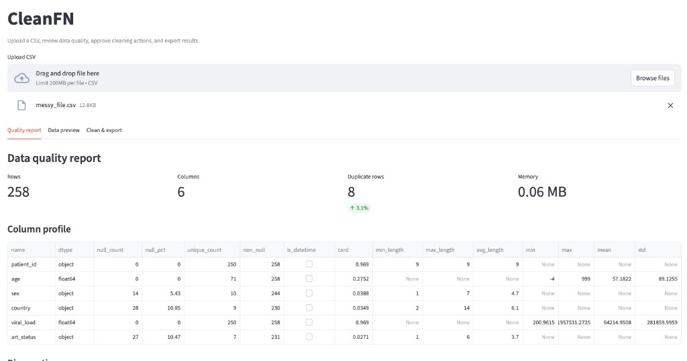
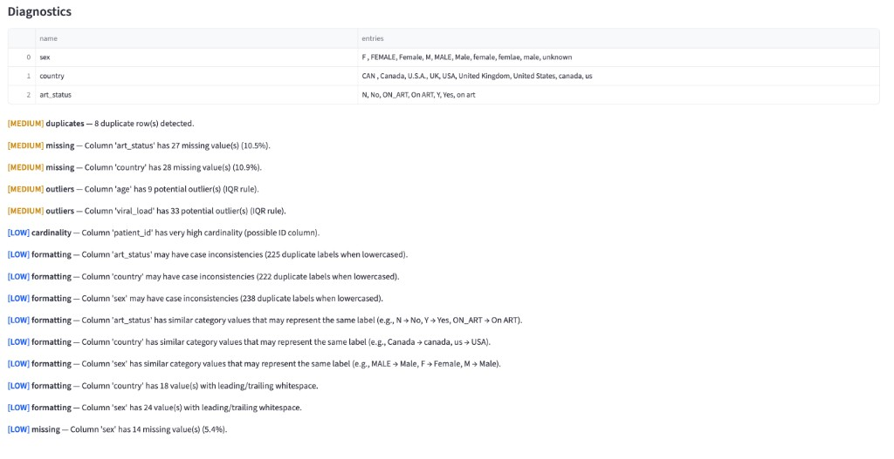
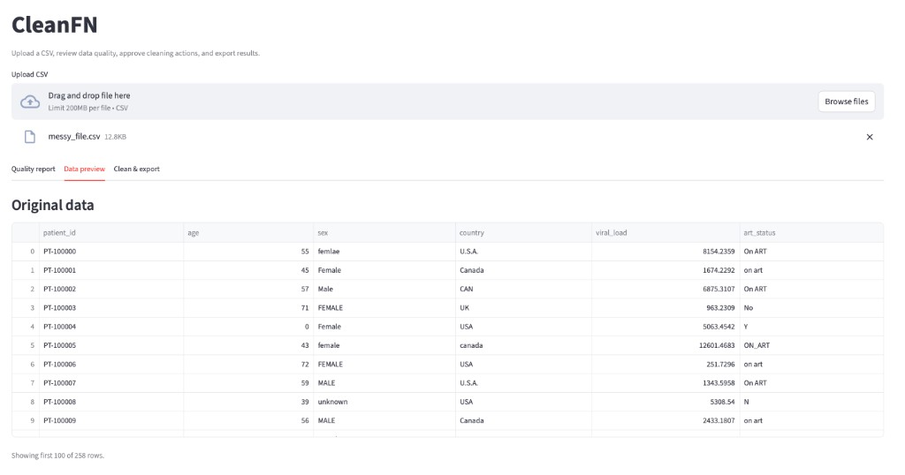
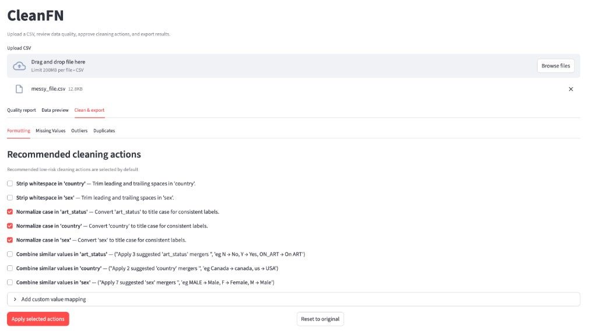

# CleanFN: Automated CSV Data Cleaning Assistant

CleanFN is a Streamlit application that analyzes messy CSV datasets, detects common data quality issues, recommends cleaning operations, and generates both a cleaned dataset and a fully reproducible Python script.

Instead of manually cleaning data with Excel, pandas, or R, users can review suggested fixes, approve only the changes they want, and export both the cleaned CSV and the code used to produce it.

## Project structure


| Module           | Role                                                 |
| ---------------- | ---------------------------------------------------- |
| `app.py`         | Streamlit UI: upload, report, approve, apply, export |
| `profiler.py`    | Dataset summary (shape, nulls, dtypes, stats)        |
| `diagnostics.py` | Data quality issue detection                         |
| `recommender.py` | Converts issues to cleaning actions                  |
| `cleaner.py`     | Applies approved actions to a DataFrame              |
| `codegen.py`     | Generates a reproducible python script               |


## Technologies

- Python
- Streamlit
- pandas
- NumPy
- RapidFuzz


## Setup

```bash
cd csv-cleaning-assistant
python -m venv .venv
source .venv/bin/activate   # for windows: .venv\Scripts\activate
pip install -r requirements.txt
```


## Run

```bash
streamlit run app.py
```


## Workflow

1. Upload a CSV file.
2. Inspect the automatically generated quality report.
3. Review recommended cleaning actions.
4. Select the fixes you want to apply.
5. Preview the cleaned dataset.
6. Download the cleaned CSV or generated Python script.


## Screenshots

### Quality report

Column-level profile with row counts, null percentages, dtypes, and summary statistics.



### Diagnostics

Severity-ranked issues such as duplicates, missing values, outliers, and inconsistent categories.



### Data preview

Scrollable view of the original uploaded data before any cleaning is applied.



### Clean & export

Review recommended actions by category, apply selected fixes, and download the cleaned CSV plus a reproducible Python script from the **Clean & export** tab.




### Quality report

Column-level profile with row counts, null percentages, dtypes, and summary statistics.

Quality report

### Diagnostics

Severity-ranked issues such as duplicates, missing values, outliers, and inconsistent categories.

Diagnostics

### Data preview

Scrollable view of the original uploaded data before any cleaning is applied.

Data preview

### Clean & export

Review recommended actions by category, apply selected fixes, and download the cleaned CSV plus a reproducible Python script from the **Clean & export** tab.

Clean & export

## Quality Report

After uploading a dataset, CleanFN automatically generates a summary including:

- Dataset dimensions
- Column data types
- Missing value percentages
- Summary statistics for numeric columns
- Duplicate rows
- Potential outliers
- High-cardinality columns
- Constant or empty columns


## Supported Cleaning Actions


| Cleaning Action                | Description                                                                                                                                                  |
| ------------------------------ | ------------------------------------------------------------------------------------------------------------------------------------------------------------ |
| Remove duplicate rows          | Removes duplicate observations from the dataset.                                                                                                             |
| Drop rows with missing values  | Removes rows with missing values in user-selected columns.                                                                                                   |
| Fill missing values            | Imputes missing values using the mean, median, mode, or stochastic imputation.                                                                               |
| Drop empty or constant columns | Removes columns that contain only missing values or a single unique value.                                                                                   |
| Strip whitespace               | Removes leading and trailing whitespace from text values.                                                                                                    |
| Normalize text case            | Converts text to a consistent case (e.g., lowercase or title case).                                                                                          |
| Clip numeric outliers          | Clips values outside the 1.5 × IQR range to the nearest IQR boundary.                                                                                        |
| Custom value mappings          | Replaces inconsistent or incorrect values with user-defined mappings.                                                                                        |
| Custom numeric bounds          | Applies user-defined lower and upper bounds. Out-of-range values can be replaced (mean, median, mode, or stochastic imputation), dropped, or left unchanged. |


## Example


### Before:


| Name    | Age         |
| ------- | ----------- |
| Alice   | 23          |
| alice   | 23          |
| Bob     | *(missing)* |
| Charlie | 1000        |


↓

### After:


| Name    | Age |
| ------- | --- |
| Alice   | 23  |
| Bob     | 23  |
| Charlie | 65  |


**Applied cleaning actions**

- Removed duplicate rows
- Imputed missing values
- Normalized capitalization
- Clipped numeric outlier (1000 → 65)


## License

This project is licensed under the MIT License. See the `LICENSE` file for details.
